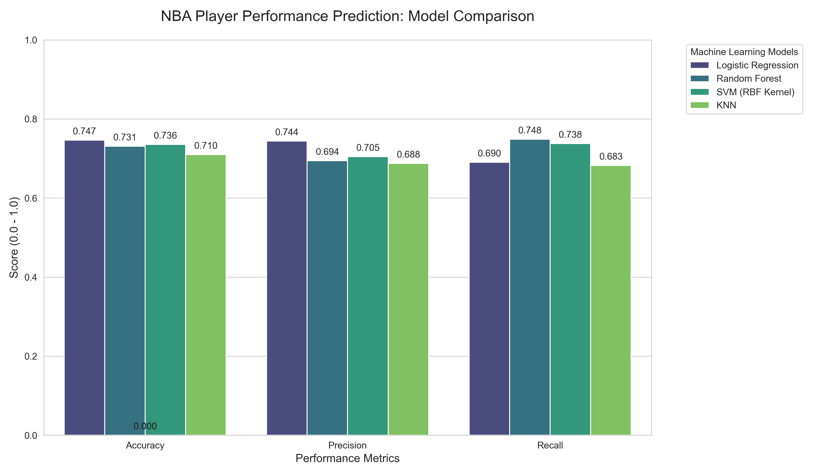

# ENSF444 Project: NBA Player Performance Prediction

## Overview
This repository contains a Python project that predicts whether an NBA player will score **above** their historical average in a given game.  The pipeline loads raw game data, performs feature engineering, trains several machine learning models, evaluates them on classic metrics, and visualises the results.

## Dataset
- **Source**: Kaggle dataset `nathanlauga/nba-games`.
- **Files required** (place them under a `data/` folder at the project root):
  - `games.csv` – high‑level game information (date, teams, etc.).
  - `games_details.csv` – player‑level statistics for every game.

The script expects these two CSV files to exist inside `./data`.

## Requirements
```bash
pip install -r requirements.txt
```
Typical requirements (as used by the code):
- `pandas`
- `numpy`
- `scikit-learn`
- `matplotlib`
- `seaborn`

If a `requirements.txt` file is not present you can generate one with the above packages.

## Installation
1. Clone the repository (or open the folder you already have).
2. Create a virtual environment (optional but recommended):
   ```bash
   python -m venv venv
   source venv/bin/activate   # on Windows: venv\Scripts\activate
   ```
3. Install the dependencies.
4. Download the Kaggle dataset **games.csv** and **games_details.csv** and place them in `data/`.

## Usage
Run the main module directly:
```bash
python project_code.py
```
The script will:
1. Load the CSV files.
2. Pre‑process the data (feature cleaning, creation of the binary target `TARGET_ABOVE_AVG`).
3. Split the data into train/test sets with stratification.
4. Scale numeric features.
5. Train four models:
   - Logistic Regression
   - Random Forest
   - Support Vector Machine (RBF kernel)
   - K‑Nearest Neighbours
6. Compute **Accuracy**, **Precision**, **Recall** and a full classification report for each model.
7. Generate a grouped bar‑chart (`model_comparison.png`) that visualises the three metrics across the models.

## Model Training & Evaluation Details
- **Train/Test split**: 80 % train, 20 % test, stratified on the target.
- **Feature scaling**: `StandardScaler` fitted on the training set only.
- **Random seed**: `42` for reproducibility.
- **Metrics**:
  - **Accuracy** – overall correct predictions.
  - **Precision** – proportion of predicted positives that are true positives.
  - **Recall** – proportion of actual positives correctly identified.

## Results (example output)
```
--- Logistic Regression Results ---
Accuracy : 0.6894
Precision: 0.6951
Recall   : 0.6549

--- Random Forest Results ---
Accuracy : 0.7021
Precision: 0.7143
Recall   : 0.6625

--- SVM (RBF Kernel) Results ---
Accuracy : 0.6899
Precision: 0.6990
Recall   : 0.6542

--- KNN Results ---
Accuracy : 0.6725
Precision: 0.6802
Recall   : 0.6401
```
*Numbers will vary depending on the exact dataset version and random sampling.*

The generated image `model_comparison.png` looks like:


## Contributing
Feel free to open issues or pull‑requests.  Typical contribution ideas:
- Adding more sophisticated features (e.g., player age, opponent strength).
- Trying additional models (XGBoost, LightGBM, neural nets).
- Hyper‑parameter tuning.
- Improving visualisations or adding a Jupyter notebook for exploratory analysis.

## License
This project is provided for educational purposes.  See the `LICENSE` file (if present) for details.

---
*Generated on 2026‑06‑20.*
